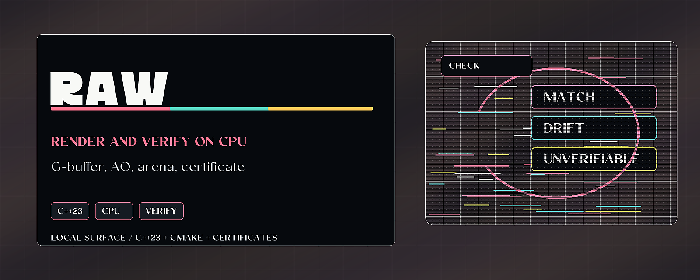

# raw-native



> Render and verify a small CPU scene with C++23, ambient occlusion, and certificates.

raw-native is a zero-dependency C++23 rendering and verification engine. It
renders a small scene, compares screen-space ambient occlusion against a
ray-traced reference, and emits JSON certificates for the render and allocator.

## Why it matters

Creative engines and scientific demos need renderers that can produce evidence,
not only pixels. raw-native is a compact CPU-side testbed for measured rendering,
bounded memory, and receipt-backed comparison.

## Try it

```sh
cmake -B build -S .
cmake --build build
ctest --test-dir build -C Debug --output-on-failure
```

## What to test first

- Build the C++23 command-line driver.
- Run CTest.
- Run `./build/raw_native_cli ./out` and inspect the generated certificates.

## Current status

Local feature branch with standalone C++23 renderer work. It has no remote
configured in this checkout, so changes here are local until a remote is added.

## Existing technical notes

A zero-dependency, two-way rendering engine in C++23.

raw-native renders a small 3D scene two ways and then checks one against the
other. It rasterizes a G-buffer, computes ambient occlusion both as
ray-traced ground truth and as a cheaper screen-space approximation, and runs
a reconcile step that measures how far the approximation drifts from the
truth. The result is written out as a witnessed certificate in JSON. All of
this runs inside a bounded, fail-closed arena allocator that refuses any
allocation past its budget rather than growing.

The engine is original work, standalone, and portable. It has no third-party
dependencies and no platform bindings. The only includes are the C++ standard
library and the engine's own headers, so it builds the same on any toolchain
with a C++23 compiler. There is no graphics API, no GPU, and no operating
system surface involved: every pixel is produced on the CPU.

## What is inside

- G-buffer rasterizer: depth, normal, position, albedo, and a coverage mask.
- Ray-traced ambient occlusion: hemisphere sampling against a linear
  acceleration structure, treated as the ground truth.
- Screen-space ambient occlusion: the cheaper approximation computed from the
  G-buffer alone.
- Reconcile step: compares the screen-space approximation against the
  ray-traced truth, reporting per-pixel error, RMSE, max error, and a
  within-tolerance verdict.
- Witnessed certificate: a re-checkable JSON record with a claim, a verdict
  (verified, refuted, or unverifiable), the oracle, and ordered evidence.
- Bounded arena allocator: a bump allocator over caller-provided memory that
  is gated by a budget. Over-budget or zero-size requests are refused, never
  served by growing. It records a lifetime witness (budget, used, high water,
  allocations, refusals) that is itself emitted as a certificate.

## Layout

```
raw/      internal headers (vectors, matrices, image buffers, scene,
          gbuffer, rasterizer, ray AO, SSAO, reconcile, certificate,
          composite, acceleration, arena)
src/      implementation sources
app/      command-line driver (main.cpp)
tests/    unit tests (one executable per test_*.cpp)
```

## Build

Requires CMake 3.24 or newer and a C++23 compiler.

```sh
cmake -B build -S .
cmake --build build
```

## Test

```sh
ctest --test-dir build -C Debug --output-on-failure
```

## Run

The command-line driver renders a 256x256 test scene and writes its outputs to
a directory you choose (defaults to the current directory):

```sh
./build/raw_native_cli ./out
```

It writes the shaded frame (`frame.ppm`), the two ambient-occlusion buffers
(`ao_rt.pgm`, `ao_ss.pgm`), the reconcile error map (`ao_error.pgm`), and the
witnessed certificates (`certificate.json`, `arena_certificate.json`). The
driver runs two passes: a measure pass that records the exact memory footprint,
then a render pass bounded to exactly that footprint, so an over-budget render
fails closed and emits a breach certificate instead of growing.

## License

MIT. See [LICENSE](LICENSE). Copyright (c) 2026 Zain Dana Harper.

## For developers

Keep the public README, build notes, and examples aligned with current behavior. Before opening a PR or pushing a release, run the local native verification path.

```bash
cmake -S . -B build
cmake --build build
ctest --test-dir build --output-on-failure
```
