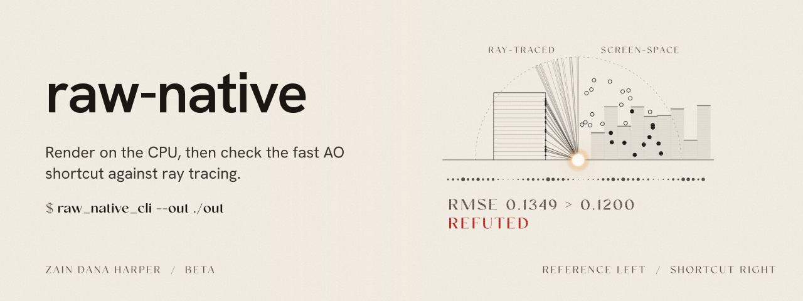
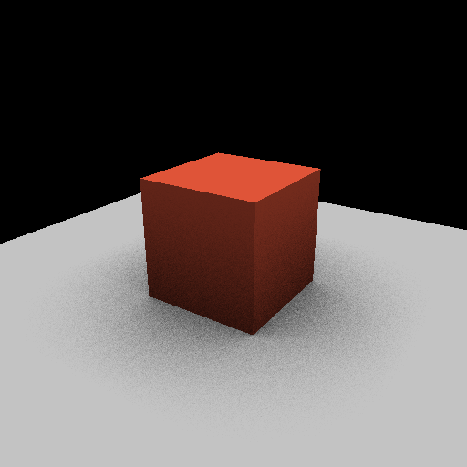
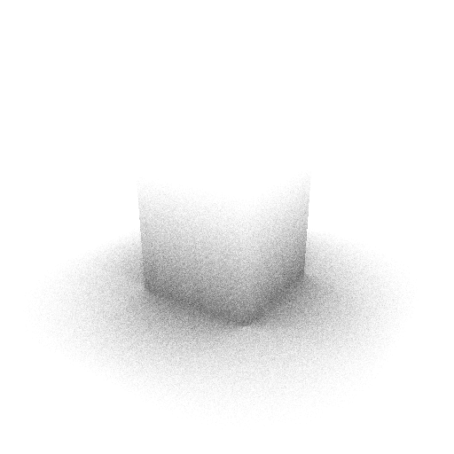
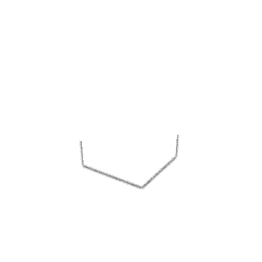
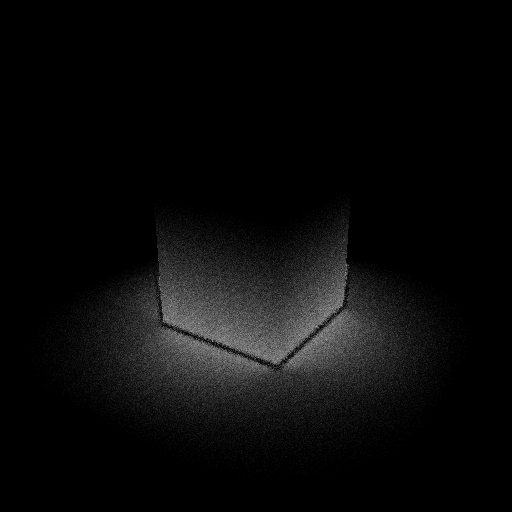

<picture>
  <source media="(prefers-color-scheme: dark)" srcset="docs/art/hero-dark.svg">
  
</picture>

# raw-native

Render on the CPU, then check the fast AO shortcut against ray tracing.

```bash
raw_native_cli --out ./out
```

[](https://github.com/HarperZ9/raw-native/releases/latest)
[](https://github.com/HarperZ9/raw-native/actions/workflows/ci.yml)
[](LICENSE)


raw-native renders a 3D scene on the CPU and tells you whether its fast lighting
shortcut can be trusted. It computes ambient occlusion twice: once with a cheap
screen-space approximation, the kind real-time engines use, and once with a
ray-traced reference. It then measures how far the shortcut drifts from the
reference and writes the answer into a small JSON certificate. The verdict is
`verified` when the drift stays inside the tolerance and `refuted` when it does
not. You get the picture and the evidence for it in the same run.

It is written in C++23 with no external dependencies, no GPU and no graphics
API. The one file it did not write itself is `superstack.hpp`, the FSL-1.1-MIT header of
the shared receipt contract, vendored and pinned by hash. Every pixel comes from the standard library and the engine's own code, so
it builds the same way on any C++23 toolchain. The same code also runs in a web
browser as WebAssembly and writes byte-identical files. Two optional builds
render the frame on the GPU, natively through D3D12 on Windows or through
WebGPU in a browser, and check every GPU frame against this CPU path. The
default build contains no GPU code.

| Shaded frame | Ray-traced AO (reference) | Screen-space AO (shortcut) | Error map |
|---|---|---|---|
|  |  |  |  |

The default view above, rendered at 512 x 512, comes back `refuted`: the
shortcut's error is 0.135 RMSE against a tolerance of 0.12. Its certificate,
with the output digests shortened here:

```json
{"claim":"screen-space AO matches ray-traced ground truth within tolerance",
 "verdict":"refuted","oracle":"raw-rt-ao-v1",
 "evidence":[["pixels","151984"],["rmse","0.1349"],["maxError","0.6406"],["tolerance","0.1200"]],
 "channels":{"ao_fidelity":0.881125,"motion_coherence":1,"hdr_headroom":0.875542},
 "schema":"raw-cert/2","renderer":"raw-native 0.5.1",
 "params":{"eye":[4,4,6],"fovy":0.899999976,"height":512,"prev_eye":null,"prev_target":null,
           "prev_up":null,"rt":true,"target":[0,1,0],"tolerance":0.119999997,"up":[0,1,0],"width":512},
 "samples":{"rt":64,"ss":24},
 "exact":{"pixels":151984,"rmse":0.134912357,"maxError":0.640625,"tolerance":0.119999997},
 "outputs":{"ao_rt.pfm":"eb60b22d4151...","ao_ss.pfm":"fddc169c7fca...","mask.pgm":"892aacd21cae...","...":"..."}}
```

The first fields are the 0.2.0 certificate, unchanged. Everything from `schema`
on is new in 0.3.0: the renderer version, every parameter that changes the
pixels, the sample counts, the reconcile values at full float precision and the
SHA-256 of every file the verdict was judged from.

## See it work, step by step

The [animated explainer](https://harperz9.github.io/repo-explainers/raw-native.html)
follows one render from the G-buffer through both occlusion estimators to the
reconcile, the certificate and `verify`. It draws a 2D slice that runs the same
rules as `ray_ao.cpp` and `ssao.cpp`, shows the five views against the
tolerance, and can run the WebAssembly build in the page. Its source is
[docs/explainer/index.html](docs/explainer/index.html).

## Watch

Rendered by this repository's v0.6.0 release from its own output, so every number on screen is one that release produced.

[](https://harperz9.github.io/media/releases/raw-native/v0.6.0/ao-check/index.html)

**[Checking the light](https://harperz9.github.io/media/releases/raw-native/v0.6.0/ao-check/index.html)** (53 s). Rendered from values read at commit 158afa8: [facts.json](https://harperz9.github.io/media/releases/raw-native/v0.6.0/ao-check/facts.json). The narration is a synthesized version of the author's voice.

[](https://harperz9.github.io/media/releases/raw-native/v0.6.0/first-run/index.html)

**[raw-native: build, render, check](https://harperz9.github.io/media/releases/raw-native/v0.6.0/first-run/index.html)** (37 s). Rendered from values read at commit 158afa8: [facts.json](https://harperz9.github.io/media/releases/raw-native/v0.6.0/first-run/facts.json). The narration is a synthesized version of the author's voice.

## Walkthrough

Install it, run it once, then use the main feature. Each command below is real, and so is its output.

1. **Get it.** Download a binary from the [latest release](https://github.com/HarperZ9/raw-native/releases/latest) (Windows x64, Linux x64 or WebAssembly) and check it against `SHA256SUMS`.

2. **First run: render and reconcile.** Render the default scene. Both occlusion estimators run, and the reconcile compares them against the tolerance.

   ```text
   $ raw_native_cli --out ./out
   reconcile: pixels=37996 rmse=0.1294 maxError=0.6094 verdict=DIVERGENT
   ```

3. **Verify the output.** Re-check every file the render wrote.

   ```text
   $ raw_native_cli verify ./out
   verify: all checks match
   ```

4. **Try another view.** Change the size and camera.

   ```text
   $ raw_native_cli --out ./high --width 512 --height 512 --eye 0,9,3 --target 0,0.5,0
   ```

5. **Or build from source.** CMake 3.24 or newer and a C++23 compiler.

   ```text
   $ cmake -S . -B build -DCMAKE_BUILD_TYPE=Release
   $ cmake --build build --config Release
   $ ctest --test-dir build -C Release --output-on-failure
   ```

## Run it now

Download a prebuilt binary from the
[latest release](https://github.com/HarperZ9/raw-native/releases/latest)
(Windows x64, Linux x64 or WebAssembly), check it against `SHA256SUMS`, and run:

```sh
raw_native_cli --out ./out
raw_native_cli verify ./out
```

Or build from source. You need CMake 3.24 or newer and a C++23 compiler
(tested with MSVC 19.50 and GCC 13.3). The WebAssembly build is pinned to
CMake 4.2.0 and emsdk 6.0.11, so its bytes match the release; see
[Run it in a browser](#run-it-in-a-browser).

```sh
cmake -S . -B build -DCMAKE_BUILD_TYPE=Release
cmake --build build --config Release
ctest --test-dir build -C Release --output-on-failure
./build/raw_native_cli --out ./out        # on Windows: build\Release\raw_native_cli.exe
```

## What one run writes

| File | Contents |
|---|---|
| `frame.ppm` | The shaded frame, 8-bit, for people to look at |
| `frame_hdr.pfm` | The same frame as unclamped linear radiance, for programs to read |
| `ao_rt.pfm`, `ao_rt.pgm` | Ray-traced ambient occlusion, the reference, as 32-bit float and as an 8-bit preview |
| `ao_ss.pfm`, `ao_ss.pgm` | Screen-space ambient occlusion, the shortcut, as 32-bit float and as an 8-bit preview |
| `mask.pgm` | Coverage mask: 255 where a surface covers the pixel. The reconcile counts only these pixels |
| `ao_error.pgm` | Per-pixel absolute difference between the two |
| `certificate.json` | Claim, verdict, oracle, evidence and the `raw-cert/2` provenance for the AO comparison |
| `arena_certificate.json` | Proof the render stayed inside its memory budget |
| `channels.json` | The certificate plus camera, coverage, depth, normal, motion, HDR and an 8x8 luminance readout |
| `receipt.json` | The same AO check as a `superstack.receipt/1` receipt (from 0.5.0), described below |

Exit code 0 means the frame rendered. Exit code 1 means the render tried to use
more memory than its budget and stopped; it still writes a memory certificate,
with the verdict `refuted`. Exit code 2 means bad input.

## Colour: tone mappers and display encodings

Ten pipelines take scene-linear Rec.709 light to display code values: a tone
mapper (clip, PBR Neutral, AgX, or the ACES 2.0 output transform at 100 or 1,000
nits) followed by an encoding (sRGB, Display P3, Rec.2020 with BT.1886, or
Rec.2100 PQ). Each has a C++ reference (`raw/renderer/colour.hpp`) and a WGSL
implementation (`web/colour/colour.wgsl`).

```sh
raw_native_cli colour list
raw_native_cli colour grid grid.f32
raw_native_cli colour apply aces2-sdr/srgb grid.f32 out.f32
python tests/web/colour_grid.py --cli build/Release/raw_native_cli.exe          # WGSL vs C++
python tools/colour/ocio_compare.py --cli build/Release/raw_native_cli.exe      # C++ vs OpenColorIO 2.6.0
```

Measured on the 36,787-value grid fixed in `evidence/m1-colour-bounds.json`
before the first run:
- **WGSL against C++:** every channel within one 8-bit code in all ten pipelines,
  on Chrome's CPU WebGPU adapter (`evidence/m1-colour-gpu-swiftshader.json`).
- **C++ against OpenColorIO 2.6.0:** largest CIEDE2000 0.0027 for ACES 2.0 SDR
  and 0.0020 for the clip pipelines; largest Delta E ITP 0.039 for ACES 2.0 at
  1,000 nits in PQ (`evidence/m1-colour-ocio.json`). A CIEDE2000 of 1 is about one
  just-noticeable difference.
- PBR Neutral and AgX have no OpenColorIO built-in, so they are checked against
  their published formulas only.

The ACES 2.0 code is a port of OpenColorIO's (BSD-3-Clause,
`third_party/NOTICE-OpenColorIO.md`). OpenColorIO is used offline to measure the
port and is not a build dependency.

## Threads and the web GPU host

`web/raw-gpu.mjs` runs WGSL compute and render pipelines through a frame graph
on WebGPU, with per-pass GPU timing, as one ES module with no dependency.
`web/threads.mjs` drives Threads on it: particles that trace one of fifteen
form fields and leave light, about 0.25 ms of GPU time per frame at 960 x 540
with 262,144 particles on an RTX 4090. The same WGSL runs natively:

```sh
raw_native_cli threads --world 5 --frames 90 --width 960 --height 540 --out ./out   # D3D12 build
```

Threads is creative media: it has no CPU reference and writes no certificate.
Open `bench/threads.html` through `python bench/serve.py` to time it in a browser.

### Textures, compositing and one device

`web/raw-gpu.mjs` also makes textures and samplers, uploads canvases, images and
pixel rows, and shares its device with a second consumer (`host.share()`), so a
page that runs several tools asks for one GPU device. `web/compositor.mjs` draws
layers of textures and 2D canvases with over or add blending, opacity and a
rectangle, onto the canvas or a texture. `composite2d()` draws the same layers
with the canvas API alone when the browser has no WebGPU.
`tests/web/host_textures.py` checks the GPU composite against a CPU composite
within 1/255 in a real browser.

## Motion: mathematical animation, live and on video

`web/motion/` turns the web host into an animation engine in the spirit of
manim. A scene is one ES module whose `frame(t)` returns what to draw at time
t:

- Bezier and arc paths, drawn with analytic anti-aliasing on the GPU. Strokes
  take dashes, miter, bevel or round joins and butt, square or round caps. Fills
  and strokes take linear and radial gradients and image fills, and any item can
  be clipped by a path. Overlapping contours leave no seams.
- Morphs between shapes by point correspondence: a circle becomes a square,
  a sentence becomes an equation, and holes stay holes.
- Text and equations as paths, from glyph atlases made with
  `scripts/glyph_atlas.py`. The equations use a small TeX subset;
  `tools/media/tex_coverage.mjs` lists any equation in a set of scenes that the
  subset or the atlas cannot draw. Every equation in films 1 to 5 can be drawn
  (`evidence/m1-tex-coverage.json`).
- Live plots, and GPU particle formations.
- A camera that flies through scale with depth of field.
- The Threads and Worlds layers underneath.

The same file gives two outputs:

```sh
python scripts/motion_render.py --root . --serve 8765
# open http://localhost:8765/docs/motion/index.html: play, scrub, step with , and .
python scripts/motion_render.py --root . --scene ../../docs/motion/demo.scene.mjs \
  --out demo.mp4 --width 3840 --height 2160 --audio narration.wav
```

The live player has play and pause, a scrub bar, chapters, captions and
parameter sliders. It does not autoplay under reduced motion. The offline
render draws frame i at exactly i / fps in headless Chrome and encodes it with
the browser's hardware encoder. On an RTX 4090 the 24-second demo renders at
3840 x 2160 in 30 s, about 25 ms a frame. Motion is creative media: no
certificate (ADR 0011).

With `post.colour` set to a colour pipeline, such as `"aces2-sdr/srgb"`, a scene's
colours are scene-linear Rec.709 light. The finish keeps them linear, and the
frame is tone-mapped and encoded by the same WGSL the colour tests hold to the C++
reference. Without it, colours stay display values, as before.

For HDR displays, `createHost({ canvas, hdr: true })` asks for an rgba16float canvas
in extended tone-mapping mode. `host.hdr` says whether the browser granted it. The
pipeline `aces2-hdr1000/srgb-extended` then carries light above SDR white to the
screen: on the canvas, 1.0 is SDR white and brighter values use the display's
headroom. `tests/web/hdr_output.py` checks this end to end against the C++
reference. A colorimeter reading of what a display shows is still to come.

The shader library's looks are post passes too. `web/shaders/post.mjs` registers:
- `crt-classic`, the Studio's tube: scanlines, masks, bloom, halation, curvature,
  chromatic aberration;
- `crt`, a physical tube;
- `film`, colour negative printed, with grain and halation;
- `dither`, old palettes with ordered, noise or blue-noise dither.

The Motion pages load it. The same stack runs outside Motion, so a Studio layer can
use it: `new PostRunner(host, sampler).run(encoder, passes, texture, ...)`. The
release scene "Looks" shows each one.

A display list can name post passes in `post.passes`. Scene passes run in linear
light before bloom, and display passes run after the finish. The shader library
registers the looks (CRT, film, dither) through `registerPass()` in
`web/motion/post.mjs`. A pass may keep its own last output, for phosphor
persistence. `python tests/web/post_passes.py` holds every pass that ships a CPU
reference to within one 8-bit code of it, on a committed frame set
(`tests/web/post_frames.mjs`).

The vector pass is measured against a CPU reference (`web/motion/vector_ref.mjs`,
16 x 16 samples a pixel) on twenty cases fixed in
`evidence/m1-vector-corpus.json` before the first run:
`python tests/web/vector_corpus.py --sheet sheet.png`. On Chrome's CPU adapter
every case is inside its bounds: paint inside shapes within 0.0003, nothing drawn
outside them, and edge pixels within 0.03 on average
(`evidence/m1-vector-swiftshader.json`).

## Media at every release

`raw-native media render` turns a repo's `docs/media/media.json` into videos.
It reads its numbers from the commit it runs at, so a video cannot describe a
different build from the one it ships with. raw-native's own spec renders two
pieces:
- **"Checking the light"**: the reference and fast ambient occlusion maps from
  the release's own render, their difference, and the certificate's verdict.
- **A first-run walkthrough**: configure, build, test, render, verify,
  recheck, each with the output those commands printed.

```sh
python tools/media/raw_native_media.py render --setup --out media-out            # GPU
python tools/media/raw_native_media.py render --setup --out media-out --adapter swiftshader   # no GPU
python tools/media/raw_native_media.py attach media-out --tag v0.6.0
```

`tools/media/raw-native` (and `raw-native.cmd`) wrap the same commands as
`raw-native media ...`.

Each scene gets its video, a poster, captions, `facts.json`, an interactive
`index.html` with the engine beside it, and `media.json` with every file's
hash.

When a release is published, `.github/workflows/media.yml` renders each scene at
960 x 540 in its own job on a hosted runner, using Chrome's CPU WebGPU adapter, and attaches the files. Other
repos call the same workflow. The narrated 4K render is made on the author's
machine and replaces them (ADR 0012).

### Checks on every render

- **Sound.** Narration and score are mixed in one place, `tools/media/audio_mix.py`,
  to the superstack.sound/1 rule: a float64 sum, then s16 at
  `floor(clamp(v) * 32767 + 0.5)`. The manifest records the mix's PCM hash,
  integrated loudness (BS.1770) and peak. The browser twin, `web/motion/audio.mjs`,
  produces the same bytes on a shared fixture, and both pass the superstack vectors.
- **Frames.** `--hash-frames` reads every frame back before the encoder sees it and
  writes `frames.sha256`. `tools/media/determinism.py SCENE` renders twice and
  compares. CI does this for two seconds of a scene on every push. On Chrome's CPU
  adapter at 640 x 360, all 1,456 frames of "Checking the light" matched
  (`evidence/m1-frame-determinism-swiftshader.json`). That shows identity on one
  adapter and browser, not across GPUs or drivers.
- **Budgets.** `budgets` in `media.json` sets limits; `tools/media/budget.py` fails
  a render that exceeds them. CI holds each four-second smoke render to 120 s.
- **Energy.** `tools/media/energy.py SCENE` integrates the GPU's reported board
  power over a render and gives joules per frame, with idle power subtracted
  separately. It says "unavailable" where there is no telemetry.
- **Encoders.** Each render's manifest lists which of H.264, HEVC, AV1 and VP9 the
  browser could encode at 1080p and 4K, in hardware and software.

### Add media to another repo

1. Write `docs/media/media.json`. Copy raw-native's: it names
   - the setup commands (a build);
   - the facts to read (JSON values, regex matches, command output, images);
   - the scenes: an explainer module in `docs/media/scenes/`, or a
     walkthrough's steps.
   A scene imports the engine as `@raw-native/motion/...`.
2. Try it locally:
   `python <raw-native>/tools/media/raw_native_media.py render --spec docs/media/media.json --setup --out media-out`.
3. Call the workflow from the repo's release:

```yaml
on:
  release:
    types: [published]
jobs:
  media:
    uses: HarperZ9/raw-native/.github/workflows/media.yml@v0.6.0
    with:
      tag: ${{ github.event.release.tag_name }}
    permissions:
      contents: write
```

4. Narrated, at 4K, on a machine with a GPU:
   - render with `--narration DIR`, where DIR holds `<scene>/narration.wav`
     and `timing.json` made from each scene's `<scene>.script.json`;
   - then run `raw_native_media.py attach DIR --tag <tag>`.

## The superstack receipt

From 0.5.0 every render also writes `receipt.json`, a `superstack.receipt/1`
receipt from the [superstack](https://github.com/HarperZ9/superstack) contract,
which several of the author's renderers and sound engines share. `certificate.json`
is unchanged, byte for byte, so existing readers keep working.

The receipt restates the AO check in the contract's form. It is canonical JSON
with a SHA-256 seal over every field, and it reports two verdicts separately:

- **identity**, `MATCH` when the subject's bytes equal the reference's and
  `DRIFT` otherwise. The subject is the screen-space AO as float32 and the
  reference is the ray-traced AO, two different estimators, so this reads
  `DRIFT` by design.
- **tolerance**, `verified`, `refuted` or `unverifiable` with a reason: the
  certificate's verdict, with the same RMSE, maximum error and bound.

It also records the scene in the contract's scene format, the hash of the
frame's raw RGB8 bytes (`frame.rgb8`), the digest of every file written and
four `does_not_prove` lines. For the default view, the scene hash and the
frame hash equal the contract's published reference scene and pixel reference,
and the ray-traced AO bytes equal the hash superstack's separate Python
renderer produced.

A `--gpu` run adds `gpu_receipt.json`: the GPU frame's RGB8 bytes against the
CPU frame's, with identity (`MATCH` when the GPU drew the same 8-bit frame) and
the tolerance verdict of `gpu_certificate.json`, which now reports the same
`identity` beside its `verdict`.

`raw_native_cli verify` checks the receipt too: the seal, every digest, the
subject and reference hashes recomputed from the float files, and the
tolerance verdict against the certificate's.

The WebAssembly build writes the same receipt. From 0.5.1, raw-native vendors
superstack 0.2.0, whose header compiles with libc++, the standard library
Emscripten uses. The wasm build's `receipt.json` is byte-identical to the
receipts from MSVC on Windows and GCC on Linux, and `raw_native_cli verify`
passes on it. In 0.5.0 the wasm build wrote no receipt, because superstack
0.1.0's header did not compile with libc++.

## Check a certificate without trusting the renderer

`raw_native_cli verify <dir>` renders nothing. It re-hashes every file the
certificate lists, recomputes the reconcile from `ao_rt.pfm`, `ao_ss.pfm` and
`mask.pgm`, and compares pixel count, RMSE, maximum error and verdict with the
recorded values. Exit code 0 means every check matches, 3 means a mismatch and
2 means a file is missing.

`scripts/recheck.py <dir>` does the same in Python with the standard library
only. It shares no code with the C++ verifier, so a bug in one shows up as a
disagreement with the other. Both reproduce the recorded RMSE bit for bit,
because the float buffers on disk are the ones the renderer measured.

To replay a render, pass the certificate's `params` object back as a params
file. The same build on the same platform gives the same output digests.

## Run it in a browser

The release includes a WebAssembly build: `raw-native.wasm`, its Emscripten
module `raw-native.mjs` and a small loader, `raw-loader.mjs`. The loader fetches
both files, checks each against the SHA-256 you pass in, and only then runs
them. It works on the page or in a Worker.

```js
import { loadRawNative } from "./raw-loader.mjs";
const raw = await loadRawNative({
  moduleUrl: "raw-native.mjs", moduleSha256: "<from SHA256SUMS>",
  wasmUrl: "raw-native.wasm",  wasmSha256: "<from SHA256SUMS>",
});
const run = raw.render({ width: 256, height: 256, eye: [0, 9, 3], target: [0, 0.5, 0] });
run.certificate;  // the same raw-cert/2 certificate the native CLI writes
run.frame;        // { width, height, rgba }
```

To build it yourself, install [emsdk](https://github.com/emscripten-core/emsdk)
6.0.11 and CMake 4.2.0, activate emsdk in your shell, and run:

```sh
cmake --preset wasm
cmake --build --preset wasm      # build-wasm/raw-native.mjs and raw-native.wasm
node wasm/run-node.mjs build-wasm/raw-native.mjs ./out-wasm
python scripts/compare_renders.py ./out ./out-wasm
```

The release's wasm files are built with emsdk 6.0.11 and CMake 4.2.0. Both
versions are pinned, because both change the wasm bytes. CMake 4.2 adds
`-fPIC` to every Emscripten compile, so a build configured with CMake 3.29
differs by bytes from one configured with 4.2.0, and still writes the same
output files. With another CMake version, `cmake --preset wasm` prints a
warning that the wasm will not match the released bytes. CI downloads
CMake 4.2.0, checks its SHA-256 and checks that the wasm build was configured
with it.

With these versions on one host system the build is byte-for-byte repeatable:
two checkouts in different directories produce the same `raw-native.wasm`. A
build on a Linux host gives different wasm bytes than a build on a Windows host,
and both write the same output files; CI checks the Linux build against the
native renderer on every push. The released wasm was built on Windows. The presets
`wasm-simd` and `wasm-threads` build the two variants in the timing table
below.

## Render on the GPU, checked against the CPU

The same frame can render on three backends. Every GPU frame ships with
`gpu_certificate.json`, which compares it with a CPU render of the same camera
and says whether the two agree.

| Backend | Build | Runs on | Shaders | Checked on |
|---|---|---|---|---|
| CPU | the default build | any C++23 toolchain, and WebAssembly | none | the reference |
| D3D12 | `-DRAW_NATIVE_GPU_D3D12=ON`, Windows only | a hardware D3D12 adapter with shader model 6.0 | HLSL generated from the WGSL, compiled by DXC | RTX 4090, driver 610.88, Windows 11 |
| WebGPU | the `wasm-gpu` preset | a browser with WebGPU and JSPI | WGSL | RTX 4090, Chrome 154, Windows 11 |

All three run the same algorithms in the same operation order: triangle setup,
rasterization with depth, normal, position and motion channels, screen-space
AO, ray-traced AO and shading. A build without a GPU backend answers `--gpu`
with exit code 4 and an `unverifiable` GPU certificate that names the reason.

### Native D3D12

```sh
cmake -S . -B build-d3d12 -DRAW_NATIVE_GPU_D3D12=ON
cmake --build build-d3d12 --config Release
build-d3d12/Release/raw_native_cli.exe --gpu --out out-gpu --width 1440 --height 900
```

It needs the Windows SDK (10.0.18362 or newer) for `dxc.exe`, `d3d12.lib` and
`dxgi.lib`, and nothing else. The binary loads only the system `d3d12.dll` and
`dxgi.dll`. `--gpu` writes the GPU frame's files to `out-gpu`, the CPU
reference to `out-gpu/cpu`, and `gpu_certificate.json` beside them; both
directories pass `raw_native_cli verify`. The certificate records the adapter
name, PCI device id and driver version. The backend picks the first hardware
adapter in the high-performance order and never falls back to a software
adapter; `RAW_NATIVE_D3D12_WARP=1` selects WARP, the Windows software
rasterizer, on purpose.

There is one shader source. `scripts/wgsl_to_hlsl.py` translates the WGSL
passes in `src/renderer/gpu/shaders/` into `src/renderer/gpu/shaders/hlsl/`
and writes each pass's binding layout beside them. The generated files are
committed, so the build needs no Python. The translator accepts a strict WGSL
subset and stops on anything outside it. CI regenerates the HLSL on every push
and fails when it differs from the committed files, so the two shader trees
cannot drift apart without a red build. A hand-written HLSL copy with a parity
test would need a GPU to catch drift, and CI runners have none.

On WARP the D3D12 path reproduces the CPU reference bit for bit: all 16 renders
of the check matrix below give an RMSE of exactly 0 on every channel, and
all 16 frames are byte-identical to the CPU frame
(`evidence/d3d12-warp-checks.json`). WARP is software, so this is evidence that
the translation is exact. It is not GPU evidence. CI runs the same WARP check
on GitHub's Windows runner, and reports the hardware test as skipped, with the
reason, because the runner has no GPU.

### WebGPU in a browser

From 0.4.0 the release adds a WebGPU build, `raw-native-gpu.mjs` and
`raw-native-gpu.wasm`. It runs the WGSL passes in the browser, then renders the
same camera on the CPU and writes the same `gpu_certificate.json`.

```js
const raw = await loadRawNative({
  moduleUrl: "raw-native-gpu.mjs", moduleSha256: "<from SHA256SUMS>",
  wasmUrl: "raw-native-gpu.wasm",  wasmSha256: "<from SHA256SUMS>",
});
const run = await raw.renderAsync({ width: 512, height: 512, gpu: true });
run.frame;            // the GPU frame
run.gpuCertificate;   // raw-gpu-cert/1: GPU against the CPU reference
run.files["cpu/certificate.json"];   // the CPU reference's own certificate
```

It needs a browser with WebGPU and JSPI; it was tested in Chrome 154. Build it
with `cmake --preset wasm-gpu` and `cmake --build --preset wasm-gpu`.

### What the GPU certificate checks

Over the pixels both sides cover:

| Check | Bound |
|---|---|
| Coverage pixels that disagree | 0.2% of pixels either side covers |
| Depth, relative RMSE | 1e-4 |
| Position, normal (RMSE per component) | 1e-3 |
| Motion vectors (RMSE, UV units) | 1e-4 |
| Screen-space AO, ray-traced AO, frame (RMSE, 0..1) | 0.01 |
| The frame's own AO verdict | must equal the CPU's; RMSE within 0.005 |

The bounds and the reasoning behind them are in `raw/cert/gpu_tolerance.hpp`, which
was committed before the first line of GPU code and before any GPU output was
seen. Both GPU backends are judged against the same bounds. Maximum errors are
reported and never bounded. The certificate also records the backend, the
adapter and driver, both render times and five `does_not_prove` lines.

## Point the camera anywhere

```sh
raw_native_cli --out ./out --width 512 --height 512 --eye 0,9,3 --target 0,0.5,0
raw_native_cli --out ./out --params view.json          # flags given after it override the file
raw_native_cli --out ./out --prev-eye 4.3,4,5.7        # a previous camera produces motion vectors
raw_native_cli --out ./out --tolerance 0.15            # recorded in the certificate
raw_native_cli --out ./out --threads 8                 # same output, faster
raw_native_cli --out ./out --no-rt                     # skip the reference; verdict is unverifiable
raw_native_cli --bench 5 --width 512 --height 512      # time 5 renders, print JSON
raw_native_cli --help
```

A params file is a flat JSON object with any of `out`, `width`, `height`, `eye`,
`target`, `up`, `fovy`, `tolerance`, `rt`, `prev_eye`, `prev_target` and
`prev_up`.

`--no-rt` shades the frame with the screen-space AO and skips the ray-traced
pass. With no reference to compare against, the certificate says
`unverifiable`, and the ray-traced files are not written.

## Measured results

All numbers come from one machine (Intel Core i7-13700KF, 24 threads, NVIDIA
RTX 4090, Windows 11 build 26220). The CPU and wasm numbers were measured on
v0.3.0, whose CPU render code later versions keep unchanged. The GPU numbers
were measured on 4 October 2026 with NVIDIA driver 610.88 (DXGI reports
32.0.16.1088), D3D12 and WebGPU in the same session.

- **Tests:** 34 of 34 CTest targets pass in Release with MSVC 19.50 and in CI
  on GitHub's Windows and Ubuntu runners. The D3D12 build adds a 35th, the
  hardware runtime test, which CI reports as skipped because the runner has
  no GPU.
- **The GPU frame matches the CPU reference, on both GPU backends.** 16 of 16
  D3D12 certificates and 16 of 16 WebGPU certificates say `verified`: three
  frame sizes and the four other views below, each with and without the
  ray-traced pass, plus a moving camera for motion vectors. Coverage agrees on
  every pixel in every case. The largest RMSE on any channel is 4.2e-5
  (ray-traced AO, low view) against a bound of 0.01, and the largest single
  pixel error is 1/64, one hemisphere ray. Each GPU frame's own AO verdict
  equals the CPU's. D3D12 and WebGPU report the same RMSE and maximum error on
  all 104 compared channel values; that is equal summaries, not a per-pixel
  comparison of the two GPU frames. The certificates also report byte
  identity of the 8-bit frames: the GPU frame equals the CPU frame (`MATCH`) in
  13 of 16 renders on both backends. The other 3 (`DRIFT`, still `verified`)
  are the ray-traced renders at 512 x 512, 1440 x 900 and the low view, where
  the ray-traced AO of a few pixels differs from the CPU by one ray (1/64).
  Evidence:
  `evidence/d3d12-rtx4090-checks.json` and
  `evidence/webgpu-rtx4090-chromium.json`.
- **GPU speed.** Median of 5 renders after one untimed warm-up, in
  milliseconds. "Every channel" includes reading back all nine buffers (about
  140 MB at 1440 x 900) and converting them for the certificate; "frame only"
  reads back the shaded frame. Both include creating the buffers, the upload,
  every pass and waiting for the GPU.

| Frame | Mode | D3D12, every channel | D3D12, frame only | WebGPU, every channel | WebGPU, frame only | native, one thread |
|---|---|---|---|---|---|---|
| 256 x 256 | Full | 5.6 | 3.9 | 11.7 | 4.9 | 258 |
| 512 x 512 | Full | 12.2 | 5.0 | 34.5 | 8.9 | 1,028 |
| 1440 x 900 | Full | 48.8 | 16.0 | 94.9 | 24.3 | 4,527 |
| 256 x 256 | No RT | 5.0 | 3.1 | 9.0 | 3.0 | 29 |
| 512 x 512 | No RT | 11.5 | 5.3 | 26.7 | 4.9 | 118 |
| 1440 x 900 | No RT | 45.7 | 13.2 | 86.3 | 15.3 | 527 |

  The WebGPU times are measured inside the wasm module in headed Chrome 154,
  so they include JavaScript promise turns and browser scheduling. They also
  move between sessions: the v0.4.0 run on the same machine measured 6.8, 14.3
  and 72.7 ms for the full frame with every channel, against 11.7, 34.5 and
  94.9 here. Read the WebGPU columns as a range, not a point. The D3D12 times
  are one run of 5 in one session, on one GPU, one driver and one OS build,
  and another adapter or driver may differ in either direction. Small gaps
  between neighbouring cells, such as 512 x 512 frame only with and without
  RT, are within run-to-run noise. The CPU column
  repeats the 0.3.0 table below. Evidence: `evidence/bench-d3d12-rtx4090.json`.
- **Reproducible output:** the default render's `frame.ppm`,
  `certificate.json`, `channels.json` and both AO float files are
  byte-identical across MSVC, GCC 13.3 on Linux and the WebAssembly build, and
  from 0.5.1 so is `receipt.json`. CI compares the three builds' files on
  every push. It also checks the pixels, both AO files, `channels.json` and the
  certificate (apart from its version string) against the hashes 0.5.0 wrote.
  `frame.ppm` is also unchanged from 0.2.0.
- **WebAssembly matches native exactly.** For all five views below at
  512 x 512, the wasm build's eight output files hash the same as the native
  build's, so RMSE, maximum error, pixel count and verdict agree with zero
  difference. The comparison tolerance (RMSE within 1e-4, maximum error within
  1/64, identical pixels and verdict) was fixed before the first wasm run.
  Evidence: `evidence/wasm-vs-native-512.json`.
- **Thread count does not change output:** `--threads 1` and `--threads 8` give
  identical files.
- **The verdict depends on the view.** Same scene, 512 x 512, tolerance 0.12:

| View | Flags | Covered pixels | RMSE | Verdict |
|---|---|---|---|---|
| Default | none | 151,984 | 0.1349 | refuted |
| High | `--eye 0,9,3 --target 0,0.5,0` | 239,854 | 0.0827 | verified |
| Low | `--eye 6,1.5,2 --target 0,1,0` | 140,838 | 0.1659 | refuted |
| Close | `--eye 2,2.5,3 --target 0,0.8,0 --fovy 0.7` | 214,043 | 0.2167 | refuted |
| Wide | `--eye 5,5,8 --target 0,0.5,0 --fovy 1.2` | 88,869 | 0.0882 | verified |

- **Speed.** Median of 5 renders, in milliseconds: wall time for one full frame
  with no file output (`--bench 5`). "Full" includes the ray-traced reference.
  "No RT" is rasterization, screen-space AO and shading only. The wasm columns
  ran in a Worker in headless Chromium 154, and the threaded build used 24
  threads.

| Frame | Mode | wasm | wasm SIMD | wasm threads | native | native 24 threads |
|---|---|---|---|---|---|---|
| 256 x 256 | Full | 252 | 298 | 32 | 258 | 241 |
| 512 x 512 | Full | 1,013 | 1,143 | 127 | 1,028 | 293 |
| 1440 x 900 | Full | 4,646 | 4,881 | 523 | 4,527 | 613 |
| 256 x 256 | No RT | 27 | 31 | 5 | 29 | 114 |
| 512 x 512 | No RT | 110 | 116 | 21 | 118 | 119 |
| 1440 x 900 | No RT | 533 | 541 | 85 | 527 | 199 |

  Single-threaded wasm runs at native speed. SIMD gives no gain, because the
  hot loops (per-pixel hashing and ray-triangle tests) do not auto-vectorize.
  The threaded wasm build is the fastest configuration measured. Native
  threading starts fresh threads for every pass, and that cost shows at small
  frames; a persistent thread pool is the next step there. The machine was
  running other work during these runs (about 60% total CPU load), which
  affects the multi-threaded columns most. Raw runs: `evidence/bench-*.json`.

- **Serving the threaded build** needs `SharedArrayBuffer`, which browsers grant
  only to pages sent with `Cross-Origin-Opener-Policy: same-origin` and
  `Cross-Origin-Embedder-Policy: require-corp`. GitHub Pages cannot set those
  headers, so a Pages site can serve the single-threaded build and not the
  threaded one. `bench/serve.py` sets them for local runs.

Limits, stated plainly:

- The scene is one built-in test scene: a box on a ground plane under one
  directional light. There is no model loader yet.
- The ray-traced reference uses 64 hemisphere samples per pixel drawn from a
  deterministic per-pixel hash. It is a repeatable estimate of the integral and
  shows visible grain.
- The screen-space method is a simple one with 24 samples per pixel. It misses
  most of the occlusion the reference finds, so most views come back `refuted`.
  The check is reporting a weak shortcut there.
- A pass on RMSE says nothing about the worst pixel. The high view passes at
  0.0827 RMSE with a 0.625 maximum error.
- Byte-identical output was checked on x86-64 with two compilers and on
  WebAssembly. Other CPU architectures are untested.

## How the memory budget works

The CLI renders twice. The first pass runs inside a generous slab and records
the exact number of bytes the frame needs. The second pass renders again inside
a budget of exactly that many bytes, using a bump allocator that refuses any
request past the budget and never grows. If anything allocates more the
second time, the render stops and the memory certificate says `refuted`.

## Use it as a library

`cmake --install build --prefix <dir>` installs the CLI, the static library, the
headers, the license and a CMake package. Then, in your project:

```cmake
find_package(raw_native 0.5 CONFIG REQUIRED)
target_link_libraries(your_target PRIVATE raw_native::raw_native)
```

The package sets `raw_native_LICENSE` to `FSL-1.1-MIT`.

## Layout

The engine is split into layers, and CI checks that each one includes only
the layers below it. The full map, the rules and the decisions behind them are
in [docs/architecture/](docs/architecture/ARCHITECTURE.md).

```
raw/<layer>/  public headers, one directory per layer:
              math     vectors, matrices, ray and triangle primitives
              core     arenas, images, threads, hashing, handles, version
              cert     certificates, the AO reconcile, GPU tolerances
              scene    the scene description and the built-in test scene
              rhi      the render hardware interface over D3D12 and WebGPU
              graph    the frame graph: passes, culling, barriers
              renderer the CPU reference and the GPU renderer
              tools    the CLI's parameters, runs, receipts and verifier
raw/*.hpp     forwarders from the 0.5 include paths, removed in 0.7.0
src/<layer>/  implementation; src/rhi/ holds one directory per backend, and
              src/renderer/gpu/shaders/ the WGSL and the HLSL generated from it
app/          command-line driver
tests/        one test executable per test_*.cpp; tests/gpu/ holds the D3D12
              runtime test
wasm/         browser loader and a Node runner for the WebAssembly build
cmake/        WebAssembly, WebGPU and D3D12 build settings
scripts/      independent recheck, render comparison, timing, the WGSL-to-HLSL
              translator, the layer check, the identity matrix and release packing
bench/        the browser timing pages (CPU wasm and WebGPU) and a local server
evidence/     raw timing runs, the wasm-versus-native comparison, the GPU
              certificates (D3D12, WARP and WebGPU) and the identity matrix's
              golden hashes
docs/         example images and certificates, and the architecture
third_party/superstack/  the vendored superstack header, its vectors and
              their pins (FSL-1.1-MIT; see NOTICE.md there)
```

## License

From version 0.3.0, raw-native is released under the Functional Source License,
Version 1.1, MIT Future License (`FSL-1.1-MIT`). See [LICENSE](LICENSE). You may
use, copy, modify and redistribute it for any purpose other than a competing
commercial product or service, and each version becomes available under the MIT
license two years after its release.

Version 0.2.0 and earlier remain under the MIT license, as released.

The files in `third_party/superstack/` are superstack 0.2.0, also under
FSL-1.1-MIT, with the notice carried in each file and in
`third_party/superstack/LICENSE.txt`. The public domain algorithms the header
contains keep their own terms. raw-native 0.5.0 vendored superstack 0.1.0,
which remains under the MIT license.

Copyright 2026 Zain Dana Harper.
